# 成都市石室联中132学校 官方网站 · 产品说明书

> 版本:v1.0　·　更新日期:2026-07-23
> 适用对象:校宣管理员、各部门投稿老师、网站运维人员

---

## 一、产品简介

成都市石室联中132学校官方网站,是学校对外展示与信息发布的门户平台。整体采用「石室书院」风格设计(朱红 + 描金 + 水墨),兼顾传统文脉与现代浏览体验,支持电脑、手机、平板访问。

网站分为**前台展示**与**后台管理**两部分:

- **前台**:面向家长、学生、社会公众,浏览学校新闻、通知、教学德育动态、师资队伍、学校概况等。
- **后台**:面向学校内部,提供文章发布、栏目内容维护、图片管理、投稿审核等功能,无需任何技术背景即可操作。

**访问地址**

| 用途 | 地址 |
| --- | --- |
| 网站前台 | http://shishi132.mm1.asia:8083 |
| 后台管理 | http://shishi132.mm1.asia:8083/admin/login |

> 说明:首次登录后台请及时修改默认密码;正式对外发布前建议配置 HTTPS 安全访问。

---

## 二、系统概览

- **响应式设计**:同一网址,电脑、手机自动适配布局。
- **六大内容栏目**:校园新闻、通知公告、教育教学、德育天地、校园风采、招生招考。
- **投稿审核机制**:部门老师投稿 → 校宣审核 → 发布,内容质量可控。
- **无障碍友好**:提供「大字版」一键切换,方便长辈阅读。
- **搜索与导航**:全站关键词搜索,面包屑、上一篇/下一篇、返回顶部等便捷导航。

---

## 三、前台功能说明(含截图)

### 3.1 网站首页

首页自上而下依次为:顶部导航栏(含搜索框、大字版切换、校训)、轮播大图、快捷入口、校园新闻 + 通知公告、教育教学 + 德育天地、校园风采、名师风采、页脚(友情链接 / 备案 / 管理登录)。

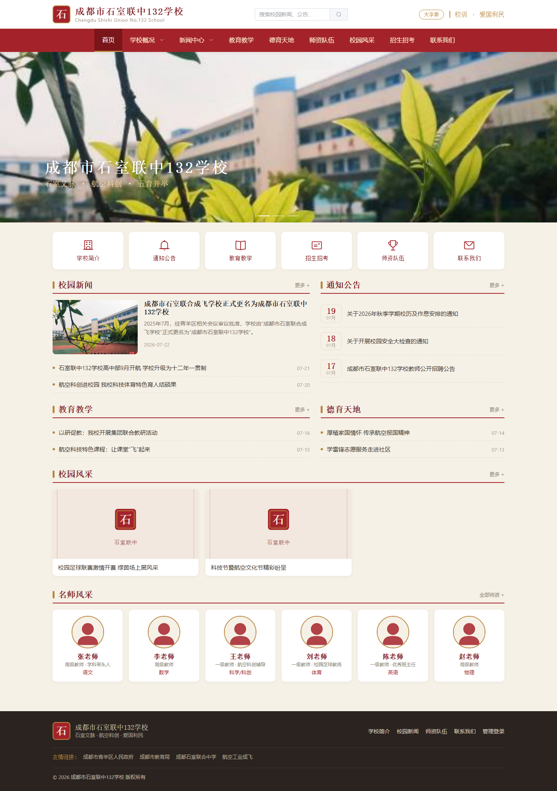

### 3.2 栏目列表页

点击任一栏目(如「校园新闻」),进入列表页。每条内容显示封面、标题、摘要、发布时间与浏览量;置顶内容带「置顶」标签;标题右侧显示「共 N 条」;底部支持翻页。

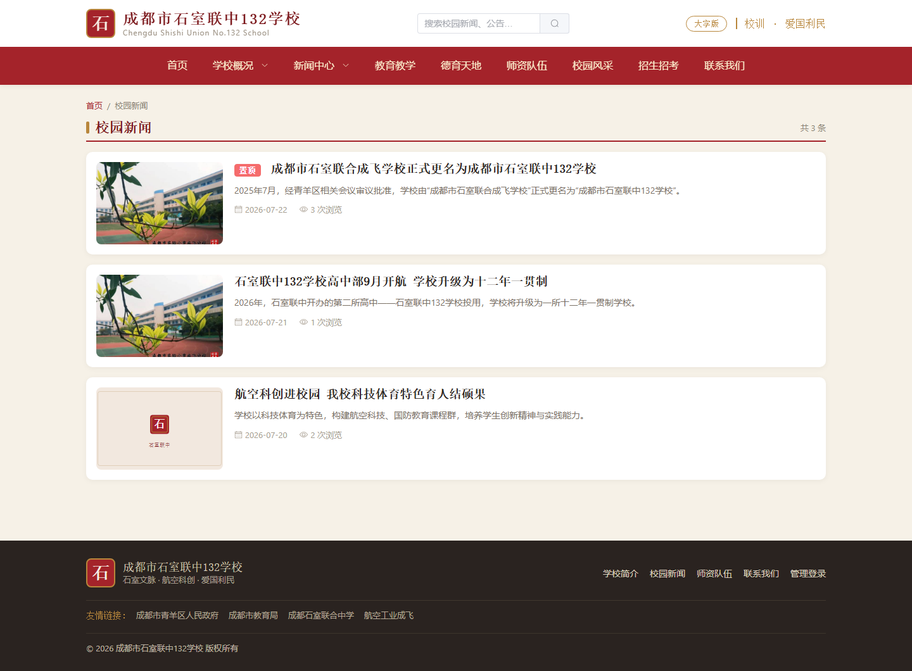

### 3.3 文章详情页

展示文章标题、发布时间、来源、作者、浏览量与正文。底部提供「上一篇 / 下一篇」快速跳转,以及「返回栏目列表」。正文中的图片、表格、视频均自动适配屏幕宽度,不会溢出。

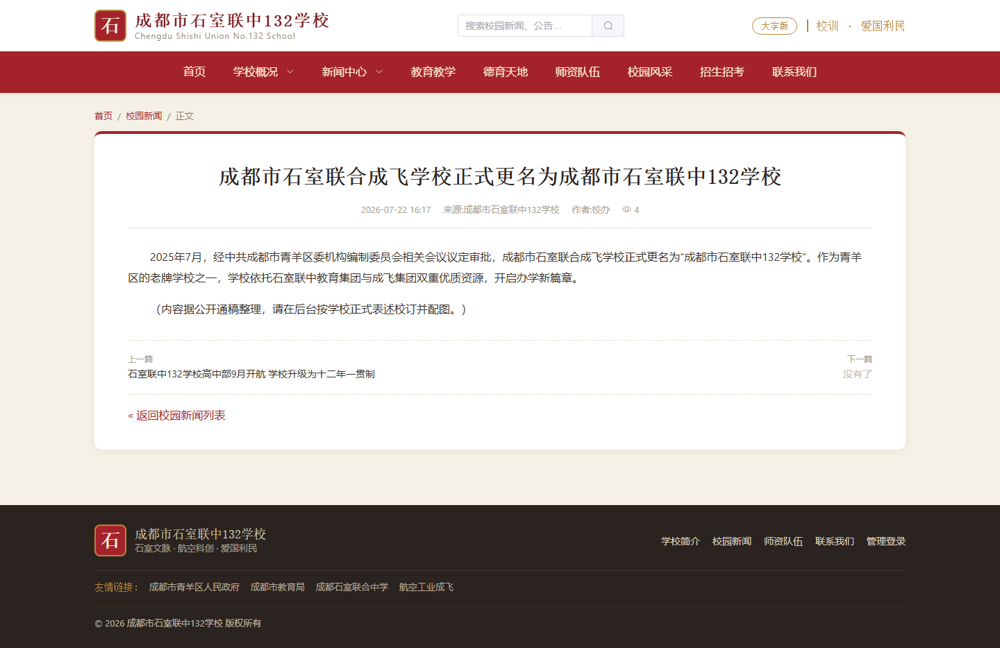

### 3.4 学校概况(单页)

「学校概况」下设学校简介、校长寄语、校园环境等单页,用于展示相对固定的介绍性内容。

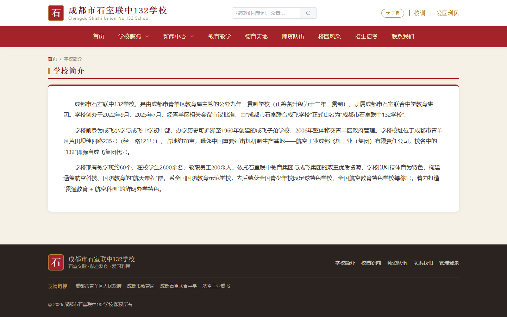

### 3.5 师资队伍

以卡片形式展示教师照片、姓名、职称与任教学科。

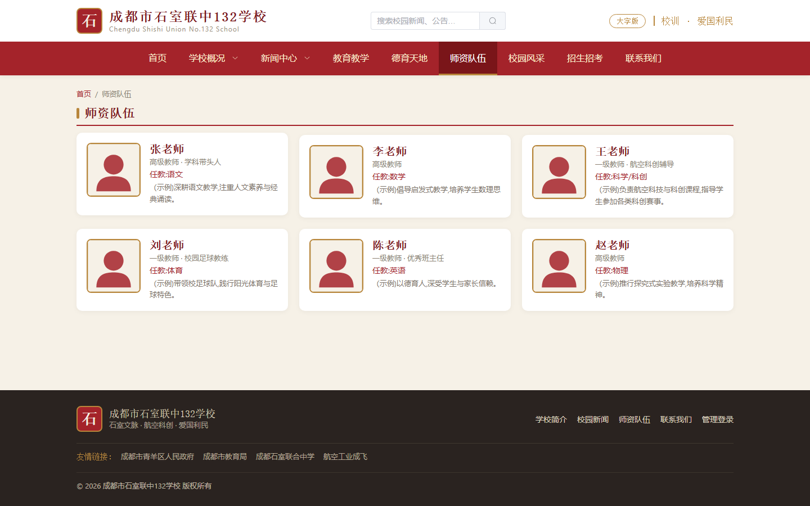

### 3.6 联系我们(在线留言)

展示学校地址等联系信息,并提供在线留言表单,访客留言会进入后台「留言管理」。

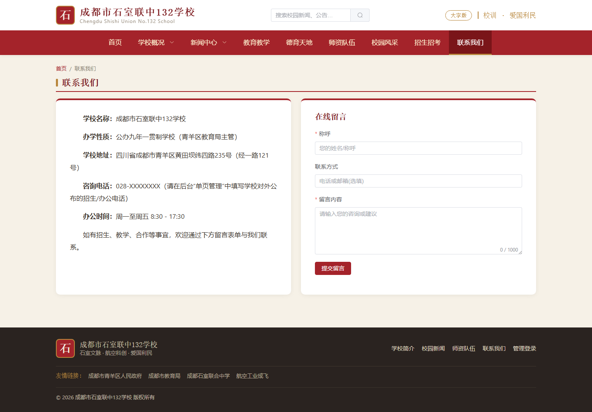

### 3.7 站内搜索

顶部搜索框输入关键词(如「学校」),即可检索标题、摘要、正文匹配的文章。

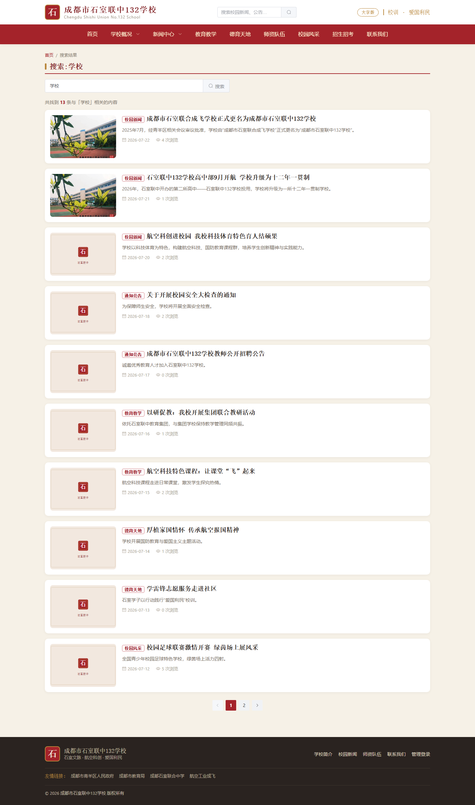

### 3.8 无障碍「大字版」

点击顶部「大字版」按钮,正文与列表文字整体放大,方便长辈与视力不便者阅读;再次点击恢复标准字号,设置会被记住。下图为文章详情的大字版效果。

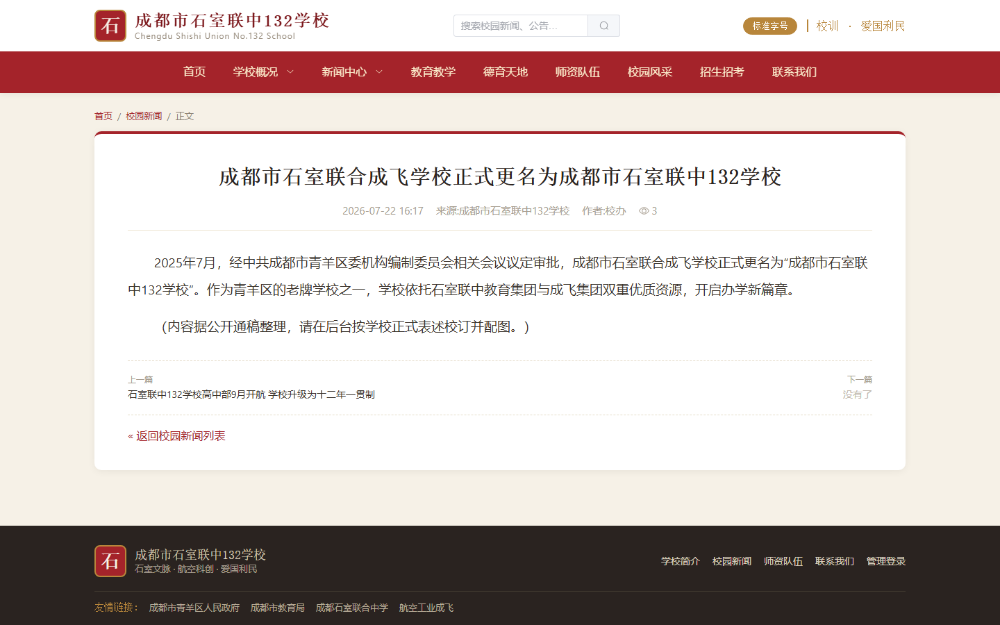

### 3.9 手机端浏览

网站自动适配手机屏幕:导航收纳为菜单按钮,轮播、栏目、列表纵向排布,单手浏览顺畅。

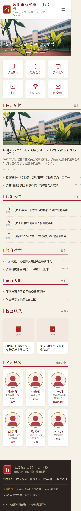

### 3.10 友好的错误页

访问不存在的地址时,展示书院风格的 404 提示页,并引导返回首页或查看校园新闻,避免出现空白页。

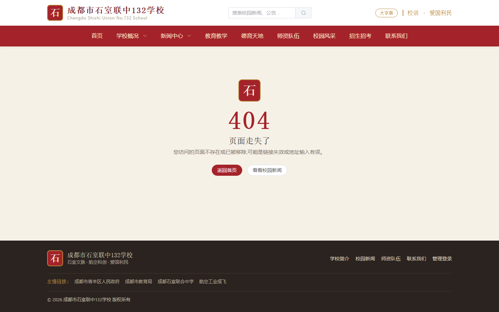

---

## 四、后台管理说明(含截图)

### 4.1 后台登录

访问 `/admin/login`,输入管理员账号与密码登录。

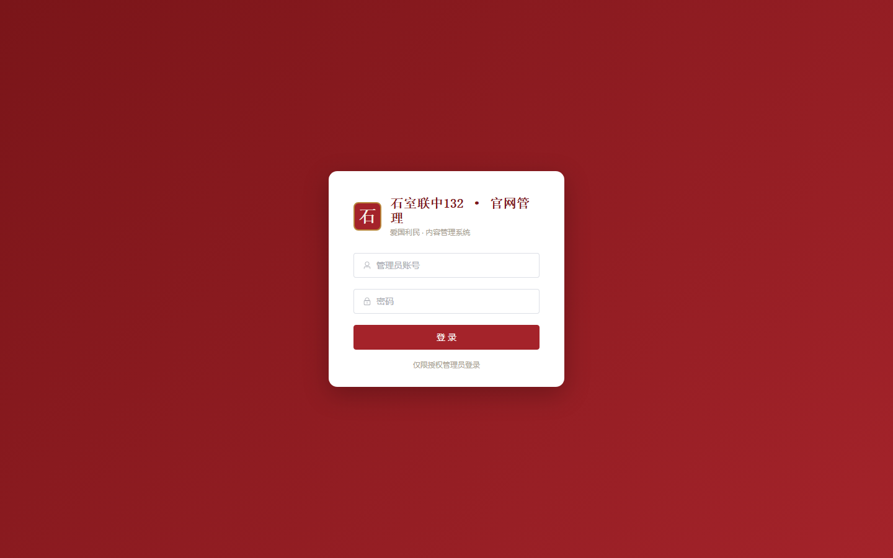

> 初始管理员:`admin` / `Shishi@2026`(**首次登录后请立即在「修改密码」中更换**)。

### 4.2 后台工作台(文章管理)

登录后进入文章管理页,可按栏目、状态筛选文章,进行新建、编辑、置顶、发布、审核等操作。左侧为功能菜单,菜单项会**根据账号角色自动显示**。

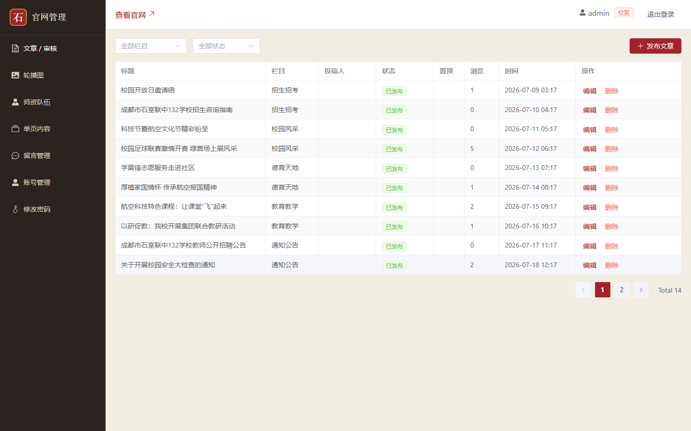

### 4.3 角色与权限

系统内置两种角色:

| 角色 | 权限范围 |
| --- | --- |
| **校宣管理员(ADMIN)** | 审核并发布文章、管理全部栏目内容(轮播图 / 师资 / 单页 / 留言 / 账号) |
| **部门投稿(EDITOR)** | 仅能撰写、修改**本人**文章并提交审核;不能操作轮播、师资、账号等 |

### 4.4 投稿与审核流程

```
部门老师撰写文章 → 提交审核(状态:待审核)
        ↓
校宣管理员审核 →  通过 → 发布(对外可见)
                └ 驳回(填写驳回理由) → 退回作者修改
```

- 文章状态:**草稿 / 待审核 / 已发布 / 已驳回**。
- 校宣管理员在文章列表可筛选「待审核」,并看到待办数量提醒。
- 被驳回的文章会显示驳回理由,作者修改后可重新提交。

### 4.5 其他管理模块(校宣管理员)

- **轮播图**:维护首页顶部大图(标题、副标题、跳转链接、排序)。
- **师资队伍**:维护教师照片与信息。
- **单页内容**:编辑学校简介、校长寄语、校园环境、联系我们等固定页面。
- **留言管理**:查看并处理前台访客留言。
- **账号管理**:新增投稿账号、重置密码、启用/停用账号(不能停用或删除自己,且系统至少保留一名校宣管理员)。
- **修改密码**:更换本人登录密码。

> 图片上传后系统会自动压缩(最长边 1600 像素),既保证清晰又控制体积。

### 4.6 手机端管理

后台管理同样适配手机:侧边菜单自动收起为左上角菜单按钮,点击展开抽屉式导航;文章列表、编辑表单均按手机屏幕宽度自适应,老师在手机上也能随时投稿、审核。

<table>
<tr>
<td align="center">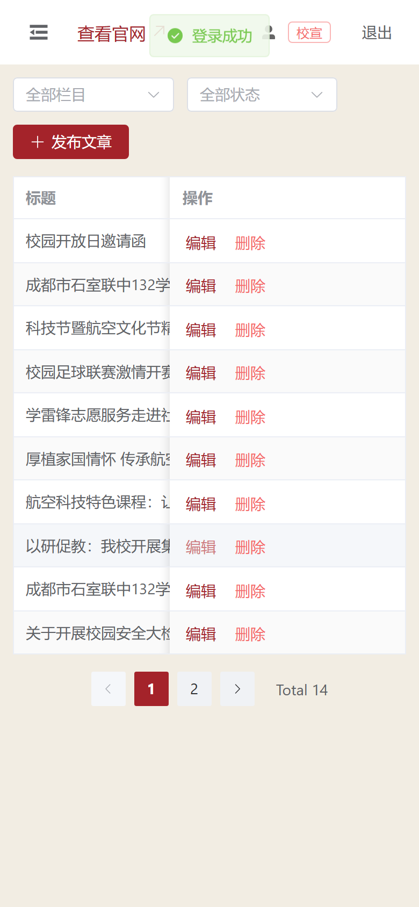<br/>手机端文章管理</td>
<td align="center">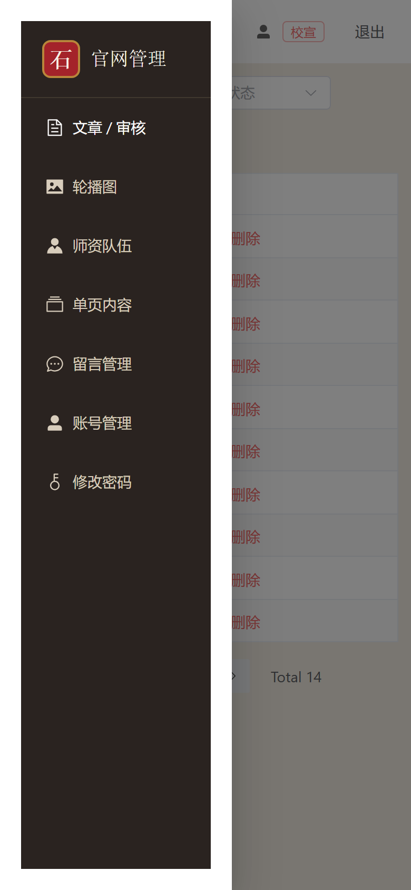<br/>抽屉式菜单</td>
<td align="center">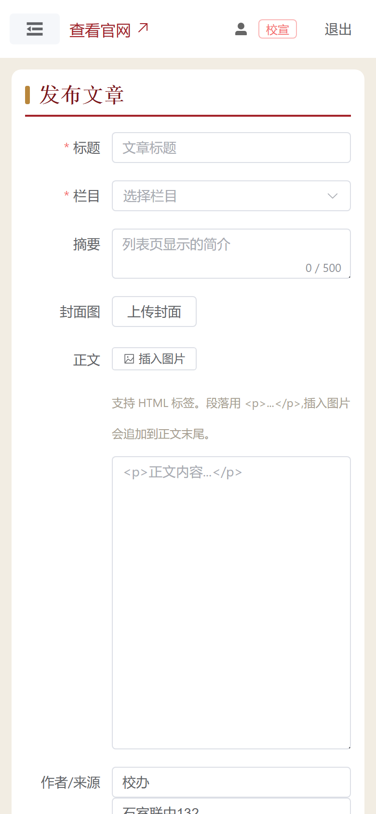<br/>手机端编辑投稿</td>
</tr>
</table>

---

## 五、常见操作指南

**发布一篇校园新闻(校宣管理员)**
1. 登录后台 → 文章管理 → 新建文章。
2. 选择栏目「校园新闻」,填写标题、摘要,上传封面图,编辑正文(可插入配图)。
3. 如需在列表靠前展示,勾选「置顶」。
4. 点击「直接发布」,前台即刻可见。

**部门投稿(投稿老师)**
1. 登录后台 → 我的投稿 → 新建。
2. 填写内容后点击「提交审核」(或先「存草稿」)。
3. 等待校宣审核;若被驳回,按驳回理由修改后重新提交。

**审核投稿(校宣管理员)**
1. 文章管理 → 筛选「待审核」。
2. 打开文章核对内容 → 「通过」发布,或「驳回」并填写理由。

---

## 六、运维信息(面向管理/技术人员)

- **技术栈**:Spring Boot 3.4 + Vue 3 + Element Plus + MySQL,前端打包进后端,单个 jar 运行(端口 8083)。
- **服务器**:与校园报障工单系统同机部署;网站服务名 `shishi-site`,数据库 `shishi_site`。
- **域名**:shishi132.mm1.asia(当前 HTTP,建议后续配置 HTTPS)。
- **发布方式**:本地构建 jar → 上传服务器 → 备份旧版本 → 重启服务 → 探活确认(每次部署自动保留最近 5 个历史版本,可快速回滚)。
- **数据安全建议**:定期备份数据库与上传图片目录;及时更换默认管理员密码。

---

## 七、待完善项(路线图)

1. **HTTPS 安全访问**:为域名配置证书,浏览器地址栏显示安全锁。
2. **SEO 与搜索收录**:提交 sitemap、优化搜索引擎收录效果。
3. **真实内容替换**:当前含书院风示例内容,需在后台逐条替换为学校正式新闻、照片与简介。
4. **登录状态持久化**:管理员令牌落库,服务重启后无需重新登录。
5. **自动备份**:数据库与图片定时自动备份。

---

*本说明书中的截图均取自线上正式环境实时画面。如界面有更新,以实际页面为准。*
